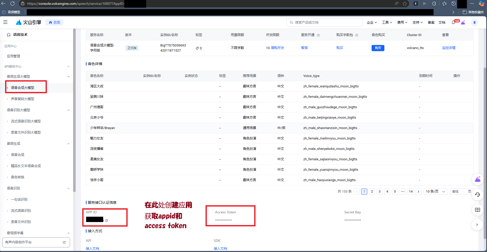
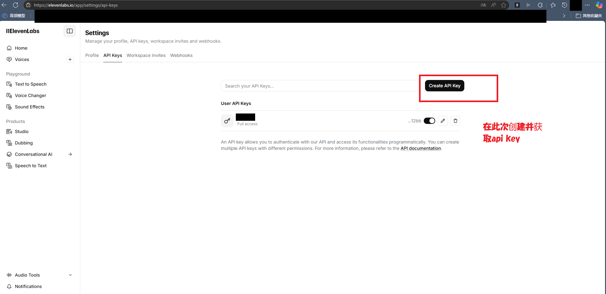
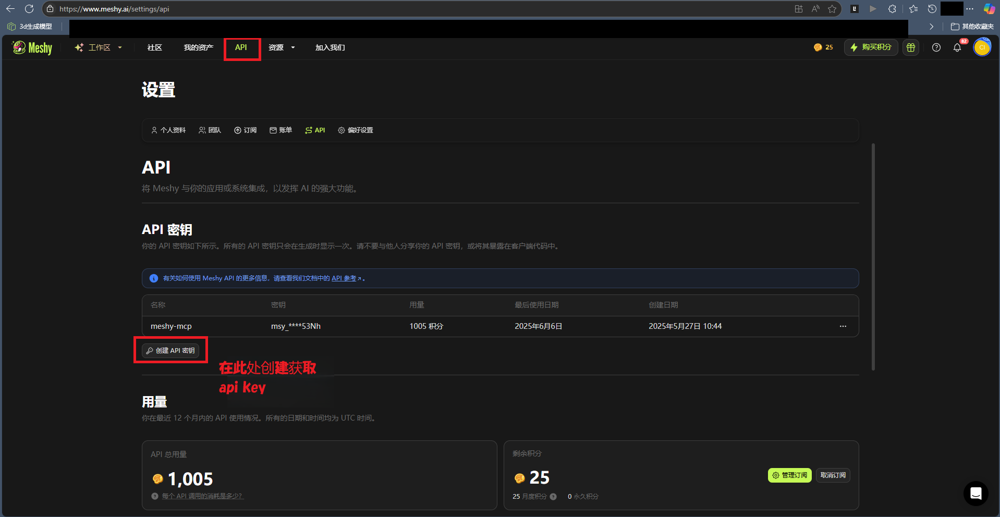
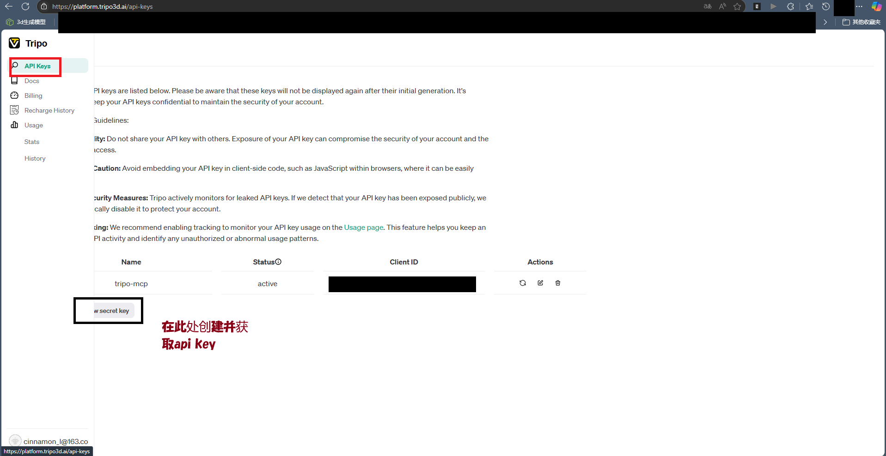
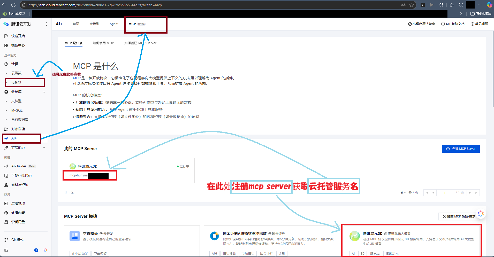
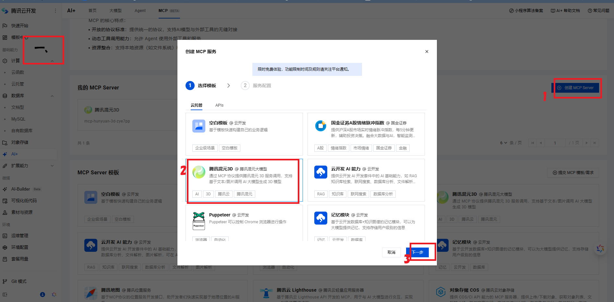
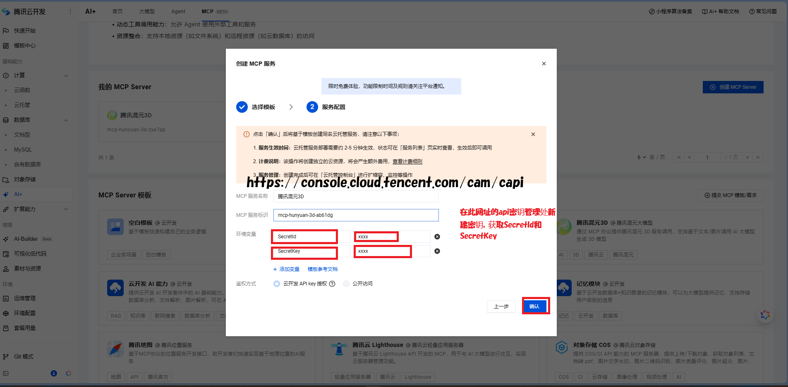
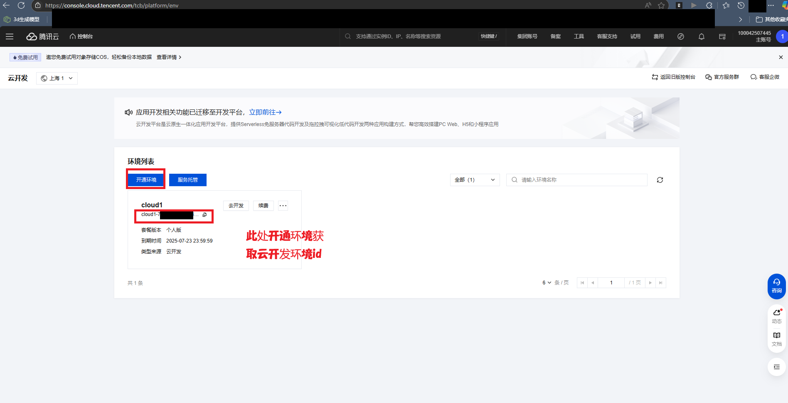
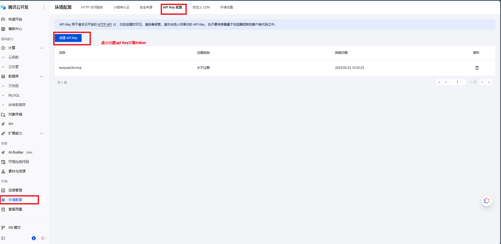

# 🎓 MCP-Course-Maker

基于 MCP 协议的线性课程开发与内容制作平台。  
本项目集成了 AI 生成、3D建模、TTS、Excel/Word 自动化、Unity 编辑器自动化等多种能力，所有服务均以 MCP Server 形式统一管理，适配 Cursor、Claude Desktop 等主流 AI IDE。

---

## 🌍 一、全局基础环境准备

### 🐍 1. Python

- **推荐版本**：Python 3.10 及以上（部分包如 image-gen-server 要求 3.10+，tripo-mcp/instant-meshes-mcp 推荐 3.8+）
- **安装方式**：  
  访问 [python.org](https://www.python.org/downloads/) 下载并安装，**务必勾选"Add Python to PATH"**。

### 🟢 2. Node.js & npm

- **推荐版本**：Node.js 18 及以上（部分服务如 excel-mcp-server 需 20+，建议统一 20+）
- **安装方式**：  
  访问 [nodejs.org](https://nodejs.org/) 下载并安装。

### ⚡ 3. uv 包管理器

- **安装命令（Windows）**：

  ```powershell
  powershell -c "irm https://astral.sh/uv/install.ps1 | iex"
  ```

- **添加到 PATH**（如未自动添加）：

  ```powershell
  set Path=%USERPROFILE%\.local\bin;%Path%
  ```

### 🔧 4. 其他依赖

- **pip**：Python 包管理工具，随 Python 安装。
- **npx**：随 Node.js 安装。
- **Unity**：如需使用 unityMCP，建议 Unity 2020.3 LTS 及以上，推荐 unity6000 版本，且项目路径无空格。

---

## 🖥️ 二、各子包详细环境配置步骤

### 🎮 1. unitymcp（Unity 编辑器自动化）

**参考：[Unity MCP 文档](https://github.com/VR-Jobs/UnityMCPbeta)**

1. **🎯 安装 Unity**  
   - 推荐 Unity 2020.3 LTS 及以上，建议 unity6000 版本。
   - 项目路径和 MCP-Course-Maker 目录下的所有子目录**不要有空格**。

2. **🐍 安装 Python 3.12+ 和 uv**  
   - 见全局基础环境准备。

3. **📦 Unity 项目中安装 Unity MCP 包**  
   - 打开 Unity → Window → Package Manager → Add package from git URL  
     填写：`https://github.com/VR-Jobs/UnityMCPbeta.git`

4. **📦 安装 Python 依赖**  
   - 进入 `Assets/unitymcp/Python` 目录，激活虚拟环境并安装 requests：

     ```bash
     cd Assets/unitymcp/Python
     .venv\Scripts\activate  # Windows
     # 或 source .venv/bin/activate  # macOS/Linux
     uv pip install requests
     ```

5. **⚙️ 配置 MCP Server**  
   - 在 MCP 客户端（如 Cursor/Claude）设置中添加如下配置：

     ```json
     {
       "mcpServers": {
         "unityMCP": {
           "command": "uv",
           "args": [
             "--directory",
             "你的绝对路径/MCP-Course-Maker/unitymcp/Python",
             "run",
             "server.py"
           ]
         }
       }
     }
     ```

6. **🚀 启动服务**  
   - 启动 Unity 编辑器，确保 MCP 窗口处于活动状态。
   - MCP 客户端会自动调用上述命令启动服务。

---

### 📊 2. excel-mcp-server（Excel 读写）

**参考：[Assets/excel-mcp-server/README.md](./Assets/excel-mcp-server/README.md)**

1. **✨ 功能简介**
   - 📊 创建和修改 Excel 工作簿
   - 📝 读写数据
   - 🎨 应用格式和样式
   - 📈 创建图表和可视化
   - 📊 生成数据透视表
   - 🔄 管理工作表和范围
   - **无需本地安装 Microsoft Excel，AI 可直接操作 Excel 文件**

2. **📦 安装方式**
   - 进入 `Assets/excel-mcp-server` 目录，执行：

     ```bash
     uv pip install -e .
     ```

3. **🚀 启动服务**
   - 默认端口 8000：

     ```bash
     uv run excel-mcp-server
     ```

   - 自定义端口（如 8080）：

     ```bash
     # Bash/Linux/macOS
     export FASTMCP_PORT=8080 && uv run excel-mcp-server
     # Windows PowerShell
     $env:FASTMCP_PORT = "8080"; uv run excel-mcp-server
     ```

4. **⚙️ 配置 MCP Server**
   - 在 MCP 客户端设置中添加如下配置：

     ```json
     {
       "mcpServers": {
         "excel": {
           "url": "http://localhost:8000/sse",
           "env": {
             "EXCEL_FILES_PATH": "/path/to/excel/files"
           }
         }
       }
     }
     ```

   - 说明：
     - `url`：excel-mcp-server 服务的 SSE 地址，通常为 `http://localhost:8000/sse`
     - `EXCEL_FILES_PATH`：Excel 文件的根目录，所有读写操作均以此为根目录

5. **🌐 协议与远程部署**
   - 本服务使用 Server-Sent Events (SSE) 协议。
   - 如需与仅支持 stdio 的客户端（如 Claude Desktop）对接，可用 [Supergateway](https://github.com/supercorp-ai/supergateway) 进行协议转换。
   - 远程部署/云端托管请参考 [Remote MCP Server Guide](https://developers.cloudflare.com/agents/guides/remote-mcp-server/)

6. **🛠️ 工具文档**
   - 完整工具列表与用法详见 [TOOLS.md](./Assets/excel-mcp-server/TOOLS.md)

---

### 📁 3. file-simp-server（文件自动重命名和压缩解压工具 FileSimp MCP Server）

**参考：下述说明**

1. **✨ 功能说明**
   - 支持对本地音频、图片、3D模型等文件进行自动重命名。
   - 可按关键词、用户指定名或当前时间自动命名，遇重名自动递增序号，确保唯一。
   - 支持类型：音频（mp3/wav）、图片（jpg/png/jpeg）、3D模型（glb/obj/fbx/stl/3mf）。
   - 支持解压zip文件到指定目录，包括密码保护的zip文件。
   - 适用于所有AI生成内容的自动归档与规范化管理，以及文件解压需求。
   - 支持项目下相对路径到绝对路径的转换需求。

2. **🔧 安装与依赖**
   - Python 3.8+，已安装 fastmcp。
   - 进入 `file-simp-server` 目录，无需额外依赖（zipfile为Python内置模块）。

3. **⚙️ 配置 MCP Server**
   - 在 MCP 客户端（如 Cursor）配置 `mcp.json`，添加如下内容：

     ```json
     "FileSimp": {
       "command": "python",
       "args": [
         "你的绝对路径/file-simp-server/server.py"
       ] ,
      "env": {
        "PROJECT_ROOT": "你的绝对路径（项目根目录）"
      }
     }
     ```

4. **🛠️ 工具注册与调用示例**

   **📝 文件重命名工具（rename_files）**：
   - 参数：
     - `folder`：目标文件夹路径
     - `file_type`：文件类型（audio/image/model/all）
     - `files`：需要重命名的文件名列表（必填）
     - `new_name`：直接命名（如"光度计.jpg"，可选）
     - `keyword`：关键词命名（如"光度计"，可选）
     - `ext`：指定后缀（如".mp3"，可选）

   **📦 zip文件解压工具（extract_zip）**：
   - 参数：
     - `zip_path`：zip文件的完整路径（必填）
     - `extract_to`：解压到的目标目录（可选，默认为zip文件同级目录的子文件夹）
     - `password`：zip文件密码（可选）
   - 功能特性：
     - 自动创建解压目录
     - 支持密码保护的zip文件
     - 完善的错误处理（文件不存在、格式错误、密码错误等）
     - 返回详细的解压结果和文件列表

---

### 🗣️ 4. doubaomcp（豆包TTS，火山引擎 TTS）

**参考：[豆包TTS文档](https://github.com/lxy2109/doubao-tts-mcp/blob/main/README.md)**

1. **🐍 安装 Python 3.8+ 和依赖**  
   - 进入 `doubaomcp/doubao-tts-mcp` 目录，执行：

     ```bash
     pip install -r requirements.txt
     pip install -e .
     ```

2. **🔑 配置环境变量**  
   - 可在 `.env` 或 MCP 配置的 env 字段中设置：

     ```
     VOLC_APPID=请替换为你的AppID
     VOLC_TOKEN=请替换为你的Token
     PORT=5001
     OUTPUT_DIR=你的绝对路径/MCP-Course-Maker/doubaomcp/doubaoOutput
     ```

   - AppID 和 Token 获取方法见下图：
   

3. **⚙️ 配置 MCP Server**  
   - 在 MCP 客户端设置中添加如下配置：

     ```json
     {
       "mcpServers": {
         "DoubaoTTS": {
           "command": "doubao-tts-mcp",
           "args": [],
           "env": {
             "VOLC_APPID": "请替换为你的AppID",
             "VOLC_TOKEN": "请替换为你的Token",
             "PORT": "5001",
             "OUTPUT_DIR": "你的目标输出路径"
           }
         }
       }
     }
     ```

4. **🚀 启动服务**  
   - MCP 客户端会自动调用上述命令启动服务。

---

### 🎤 5. elevenlabs-mcp（ElevenLabs TTS）

**参考：[elevenlabs-mcp 官方文档](https://github.com/elevenlabs/elevenlabs-mcp)**

1. **🐍 安装 Python 3.12+ 和依赖**  
   - 进入 `elevenlabs-mcp` 目录，执行：

     ```bash
     pip install -r requirements.txt
     ```

2. **🔑 配置 API Key 和输出目录**  
   - 在 MCP 配置的 env 字段中设置：

     ```
     ELEVENLABS_API_KEY=请替换为你的ElevenLabs API Key
     ELEVENLABS_MCP_BASE_PATH=你的绝对路径/MCP-Course-Maker/elevenlabs-mcp/elevenlabsOutput
     ```

   - API Key 获取方法见下图：
   

3. **⚙️ 配置 MCP Server**  
   - 在 MCP 客户端设置中添加如下配置：

     ```json
     {
       "mcpServers": {
         "ElevenLabs": {
           "command": "python",
           "args": [
             "你的绝对路径/elevenlabs-mcp/elevenlabs_mcp/server.py"
           ],
           "env": {
             "ELEVENLABS_API_KEY": "请替换为你的ElevenLabs API Key",
             "ELEVENLABS_MCP_BASE_PATH": "你的目标输出路径"
           }
         }
       }
     }
     ```

4. **🚀 启动服务**  
   - MCP 客户端会自动调用上述命令启动服务。

---

### 🤖 6. MiniMax（AI 生成/对话/多模态）

**参考：[MiniMax-MCP 官方文档](https://github.com/MiniMax-AI/MiniMax-MCP)**

1. **🔑 获取 API Key**  
   - 前往 [MiniMax Global](https://www.minimax.io/platform/user-center/basic-information/interface-key) 或 [MiniMax中国区](https://platform.minimaxi.com/user-center/basic-information/interface-key) 获取你的 API Key。

2. **⚡ 安装 uvx**  
   - uvx 随 uv 安装，若未安装请参考 uv 官方文档。

3. **⚙️ 配置 MCP Server**  
   - 在 MCP 客户端设置中添加如下配置：

     ```json
     {
       "mcpServers": {
         "MiniMax": {
           "command": "uvx",
           "args": [
             "minimax-mcp"
           ],
           "env": {
             "MINIMAX_API_KEY": "请替换为你的MiniMax API Key",
             "MINIMAX_MCP_BASE_PATH": "你的输出目录",
             "MINIMAX_API_HOST": "https://api.minimax.chat 或 https://api.minimaxi.chat",
             "MINIMAX_API_RESOURCE_MODE": "local 或 url"
           }
         }
       }
     }
     ```

   - **⚠️ 注意**：API Key 和 Host 必须区域匹配，否则会报 invalid api key 错误。  
     - 全球区 Host：`https://api.minimaxi.chat`  
     - 中国区 Host：`https://api.minimax.chat`

4. **🚀 启动服务**  
   - MCP 客户端会自动调用上述命令启动服务。

---

### 🎨 7. image-gen-server-main（即梦AI图像生成）

**参考：[image-gen-server 文档](https://github.com/fengin/image-gen-server)**

1. **🐍 安装 Python 3.10+ 和 uv**  
   - 见全局基础环境准备。

2. **📦 安装依赖**  
   - 进入 `image-gen-server-main` 目录，执行：

     ```bash
     pip install -r requirements.txt
     pip install uv
     ```

3. **🔑 配置 API Token 和图片保存路径**  
   - 推荐在 `mcp.json` 的 JiMengAI 服务下配置 `env` 字段：

     ```json
       "JIMENG_API_TOKEN": "请替换为你的即梦sessionid",
       "IMG_SAVA_FOLDER": "请替换为你的图片保存目录"
     ```

   - `server.py` 已支持自动读取上述环境变量，无需再在代码或 .env 文件中硬编码。
   - sessionid 获取方法：登录 [即梦官网](https://jimeng.jianying.com/)，F12 → Application → Cookies → 找到 sessionid。

4. **⚙️ 配置 MCP Server**  
   - 在 MCP 客户端设置中添加如下配置：

     ```json
     {
       "mcpServers": {
         "JiMengAI": {
           "command": "uv",
           "args": [
             "run",
             "--with",
             "fastmcp",
             "fastmcp",
             "run",
             "你的绝对路径/image-gen-server-main/server.py"
           ],
           "env": {
             "JIMENG_API_TOKEN": "请替换为你的即梦sessionid",
             "IMG_SAVA_FOLDER": "请替换为你的图片保存目录"
           }
         }
       }
     }
     ```

5. **🚀 启动服务**  
   - MCP 客户端会自动调用上述命令启动服务。

---

### 🖼️ 8. baidu-image-recognition-mcp（百度图像识别 MCP 工具）

**参考：[baidu-image-recognition-mcp/README.md](./baidu-image-recognition-mcp/README.md)**

1. **🐍 安装 Python 3.8+ 和依赖**  
   - 进入 `baidu-image-recognition-mcp` 目录，执行：

     ```bash
     python install.py
     # 或手动安装
     pip install -r requirements.txt
     ```

2. **🔑 配置 API Key**  
   - 编辑 `.env` 文件，添加：

     ```env
     BAIDU_API_KEY=your_actual_api_key
     BAIDU_SECRET_KEY=your_actual_secret_key
     ```

   - API Key 获取方法：
     1. 注册百度智能云账号：<https://cloud.baidu.com/>
     2. 控制台 → 人工智能 → 图像识别 → 创建应用，获取API Key和Secret Key

3. **⚙️ 配置 MCP Server**  
   - 在 MCP 客户端设置中添加如下配置：

     ```json
     {
       "mcpServers": {
         "BaiduImageRecognition": {
           "command": "python",
           "args": ["你的绝对路径/baidu-image-recognition-mcp/server.py"],
           "env": {
             "BAIDU_API_KEY": "your_actual_api_key",
             "BAIDU_SECRET_KEY": "your_actual_secret_key"
           }
         }
       }
     }
     ```

4. **🚀 启动服务**  
   - MCP 客户端会自动调用上述命令启动服务。

---

### 🖼️ 9. picui-image-upload-mcp（Picui 图床 MCP Server）

**参考**：[picui-image-upload-mcp/README.md](./picui-image-upload-mcp/README.md)

1. **✨ 功能简介**
   - 基于 [PICUI 图床](https://picui.cn/) 的多功能 API 封装，支持用户资料、策略列表、Token 生成、图片上传（本地文件）、图片列表、删除图片、相册列表、删除相册等操作，适用于 MCP 智能体工具集成。

2. **🔧 依赖环境**
   - Python 3.8+
   - 依赖包见 [`picui-image-upload-mcp/requirements.txt`](./picui-image-upload-mcp/requirements.txt)

3. **🚀 快速开始**
   - 安装依赖：

    ```bash
    pip install -r picui-image-upload-mcp/requirements.txt
    ```

   - 配置 `mcpjson`（见下方详细示例）
   - 运行服务：

    ```bash
    python picui-image-upload-mcp/server.py
    ```

4. **⚙️ mcpjson 配置详细示例**

   在你的 MCP Host 客户端（如 Cursor）配置文件中添加如下内容：

   ```json
   {
     "mcpServers": {
       "Picui": {
         "command": "python",
         "args": [
           "你的绝对路径/picui-image-upload-mcp/server.py"
         ],
         "env": {
           "PICUI_TOKEN": "你的BearerToken"
         }
       }
     }
   }
   ```

   - `command`：调用 Python 运行 `server.py` 脚本。
   - `args`：填写 `server.py` 的绝对路径。
   - `env.PICUI_TOKEN`：你的 Picui 个人中心获取的 Bearer Token（登录 [picui.cn](https://picui.cn/) → 个人中心 → Token）。

   > 💡 建议将此配置保存为 [`mcpjson.example`](./picui-image-upload-mcp/mcpjson.example) 或直接粘贴到你的主配置文件。

---

### 🎲 10. meshy-ai-mcp-server（Meshy3D建模）

**参考：[meshy-ai-mcp-server 文档](https://github.com/pasie15/scenario.com-mcp-server)**

1. **🐍 安装 Python 3.9+ 和依赖**  
   - 进入 `meshy-ai-mcp-server` 目录，执行：

     ```bash
     pip install -r requirements.txt
     ```

2. **🔑 配置 API Key**  
   - 在 MCP 配置的 env 字段中设置：

     ```
     MESHY_API_KEY=请替换为你的Meshy API Key
     ```

   - API Key 获取方法见下图：
   

3. **⚙️ 配置 MCP Server**  
   - 在 MCP 客户端设置中添加如下配置：

     ```json
     {
       "mcpServers": {
         "Meshy3D": {
           "command": "python",
           "args": [
             "你的绝对路径/meshy-ai-mcp-server/src/server.py"
           ],
           "env": {
             "MESHY_API_KEY": "请替换为你的Meshy API Key"
           }
         }
       }
     }
     ```

4. **🚀 启动服务**  
   - MCP 客户端会自动调用上述命令启动服务。

---

### 🎯 11. tripo-mcp（Tripo3D 3D建模）

**参考：[tripo-mcp 文档](https://github.com/lxy2109/tripo-mcp)**

1. **🐍 安装 Python 3.8+ 和依赖**  
   - 进入 `tripo-mcp` 目录，执行：

     ```bash
     pip install -r requirements.txt
     ```

2. **🔑 配置 API Key**  
   - 在项目根目录创建 `.env` 文件，内容如下：

     ```
     TRIPO_API_KEY=请替换为你的Tripo3D_API_Key
     ```

   - 或在 MCP 配置的 env 字段中设置。
   - API Key 获取方法见下图：
   

3. **⚙️ 配置 MCP Server**  
   - 在 MCP 客户端设置中添加如下配置：

     ```json
     {
       "mcpServers": {
         "Tripo3D": {
           "command": "python",
           "args": [
             "你的绝对路径/tripo-mcp/src/main.py"
           ],
           "env": {
             "TRIPO_API_KEY": "请替换为你的Tripo3D_API_Key"
           }
         }
       }
     }
     ```

4. **🚀 启动服务**  
   - MCP 客户端会自动调用上述命令启动服务。

---

### 🌀 12. hunyuan3d-mcp（混元3D建模）

**参考：[云开发MCP Host官方文档](https://docs.cloudbase.net/ai/mcp/use/mcp-host)**

1. **🟢 安装 Node.js 18+ 和 npx**  
   - 见全局基础环境准备。

2. **🔑 获取云开发 API KEY 和服务名**  
   - 前往云开发平台获取 API KEY
   - 获取 MCP Server 的云托管服务名

   以下为获取流程截图：

   1. 在云开发控制台左侧选择"AI+"，点击"MCP"，在此处注册mcp server并获取云托管服务名：
   

   2. 点击"创建 MCP Server"，选择"腾讯混元3D"，点击"下一步"：
   

   3. 填写服务配置，SecretId/SecretKey 可在 <https://console.cloud.tencent.com/cam/capi> 新建密钥获取：
   

   4. 在"环境配置"页面，点击"开启环境"获取云开发环境id：
   

   5. 在"API Key 配置"页面，点击"创建 API Key"获取token：
   

3. **⚙️ 配置 MCP Server**  
   - 在 MCP 客户端设置中添加如下配置：

     ```json
     {
       "mcpServers": {
         "Hunyuan3D": {
           "command": "npx",
           "args": [
             "-y",
             "@cloudbase/mcp-transformer",
             "postToStdio",
             "--url",
             "https://your-env-id.api.tcloudbasegateway.com/v1/cloudrun/your-service-name/messages",
             "--token",
             "your-token"
           ]
         }
       }
     }
     ```

     上述配置中，替换以下内容：

       - your-server-name: MCP Server 名称
       - your-token: 在云开发平台获取的 API KEY
       - your-env-id: 云开发环境 ID
       - your-service-name: 云托管服务名

4. **🚀 启动服务**  
   - MCP 客户端会自动调用上述命令启动服务。

---

### 🔧 13. instant-meshes-mcp（模型重拓扑/减面）

**参考：[instant-meshes-mcp 文档](https://github.com/lxy2109/instant-meshes-mcp)**

1. **🐍 安装 Python 3.8+ 和依赖以及blender3.6**  
   - 进入 `instant-meshes-mcp` 目录，执行：

     ```bash
     pip install -e .
     ```

   - 确保 `Instant Meshes.exe` 放在 instant-meshes-mcp 根目录。
   - **下载并安装 Blender 3.6**：
     - 官方下载地址：[https://www.blender.org/download/releases/3-6/](https://www.blender.org/download/releases/3-6/)
     - 选择适合您操作系统的版本（Windows/macOS/Linux）
     - 安装完成后，记录 Blender 的安装路径（如：`C:\Program Files\Blender Foundation\Blender 3.6\blender.exe`）

2. **⚙️ 配置 MCP Server**  
   - 在 MCP 客户端设置中添加如下配置：

     ```json
     {
       "mcpServers": {
         "InstantMeshes": {
           "command": "instant-meshes-mcp",
           "env": {
             "PYTHONUNBUFFERED": "1",
             "BLENDER_PATH": "你的Blender3.6安装目录绝对路径"
           }
         }
       }
     }
     ```

   - **⚠️ 注意**：将 `BLENDER_PATH` 替换为实际的 Blender 安装路径，例如：
     - **Windows**: `C:\\Program Files\\Blender Foundation\\Blender 3.6\\blender.exe`
     - **macOS**: `/Applications/Blender.app/Contents/MacOS/Blender`
     - **Linux**: `/usr/bin/blender` 或 `/opt/blender/blender`

3. **🚀 启动服务**  
   - MCP 客户端会自动调用上述命令启动服务。

---

## 🖥️ 三、MCP Host 客户端配置（以 Cursor 为例）

1. 打开 Cursor 设置 → Features → MCP Servers → Add new MCP server
2. 按照上文各服务的 MCP Server 配置添加所有服务
3. 保存后，Cursor 会自动启动并管理所有 MCP Server

---

## ❓ 四、常见问题与排查

- **📦 依赖未安装/版本不符**：请严格按照各服务 README 要求安装依赖和指定版本。
- **🔑 API Key/Token 未配置**：部分服务需在 .env 或 server.py 中手动填写密钥。
- **🔌 端口冲突/服务未启动**：如遇端口占用或服务未响应，检查是否有其他进程占用，或尝试重启。
- **🎮 Unity 路径/权限问题**：Unity 项目路径不能有空格，需有读写权限。
- **📊 Excel MCP 仅支持 Windows**，且需本地安装 Excel。

---

## 🎯 五、使用示例

- **🎨 生成图片**：  
  "帮我生成一张产品logo，保存到 images 目录"
- **🎲 生成3D模型**：  
  "用文本生成一个卡通小猫的3D模型"
- **📊 Excel 操作**：  
  "读取 你的绝对路径/你的Excel文件.xlsx 的 Sheet1 前10行数据"
- **🗣️ TTS 合成**：  
  "用女声朗读'你好，欢迎使用MCP工具'，保存到指定目录"

---

## 📚 六、参考文档

- [MiniMax-MCP 官方文档](https://github.com/MiniMax-AI/MiniMax-MCP)
- [豆包TTS文档](https://github.com/lxy2109/doubao-tts-mcp/blob/main/README.md)
- [云开发MCP Host官方文档](https://docs.cloudbase.net/ai/mcp/use/mcp-host)
- [excel-mcp-server 文档](https://cloud.tencent.com/developer/mcp/server/10590)
- [image-gen-server](https://github.com/fengin/image-gen-server)
- [tripo-mcp](https://github.com/lxy2109/tripo-mcp)
- [elevenlabs-mcp](https://github.com/elevenlabs/elevenlabs-mcp)
- [meshy-ai-mcp-server](https://github.com/pasie15/scenario.com-mcp-server)
- [instant-meshes-mcp](https://github.com/lxy2109/instant-meshes-mcp)
- [Unity MCP](https://github.com/VR-Jobs/UnityMCPbeta)

---

如有具体服务启动报错、API Key 配置、依赖安装等问题，可根据上述文档和本地日志进行排查，或进一步咨询相关开源项目社区。
