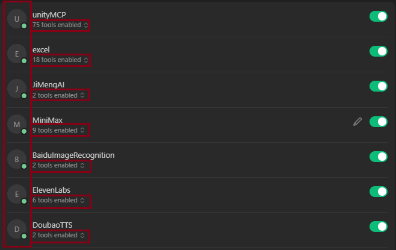
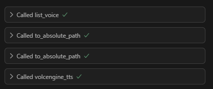
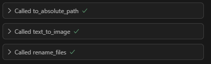
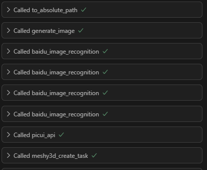
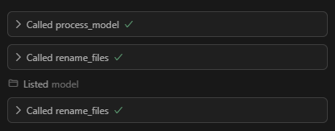
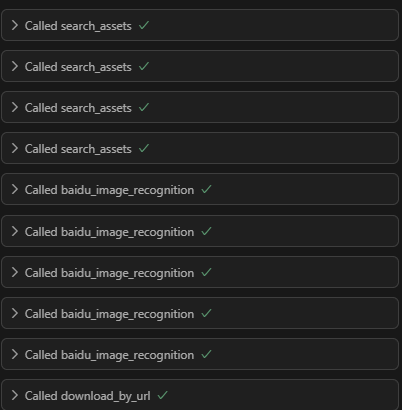
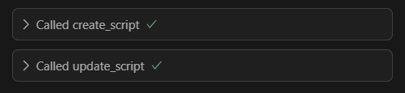
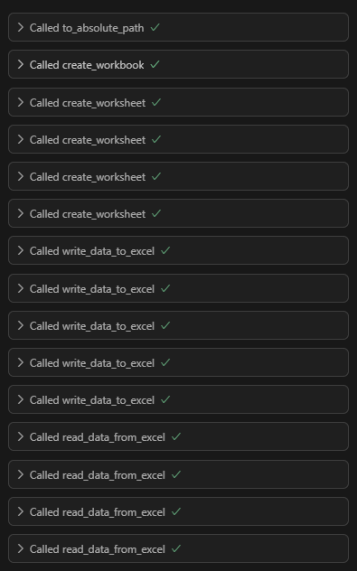

# 使用手册

## 目录

- [简介](#简介)
- [安装与环境配置](#安装与环境配置)
- [快速开始](#快速开始)
- [功能说明](#功能说明)
- [常见问题与解决方案](#常见问题与解决方案)
- [注意事项](#注意事项)
- [更新日志](#更新日志)
- [联系方式与支持](#联系方式与支持)

---

## 简介

基于 MCP 协议的线性课程开发与内容制作平台。  
本项目集成了 AI 生成、3D建模、TTS、Excel/Word 自动化、Unity 编辑器自动化等多种能力，所有服务均以 MCP Server 形式统一管理，适配 Cursor、Claude Desktop 等主流 AI IDE。

---

## 安装与环境配置

### 1. 系统要求

- Windows10+
- Unity Editor版本：2022.3.xxf1c2
- Blender版本：3.6+ (<4.0)

### 2. 安装步骤

- 下载源码/安装包

     ```bash
     git clone <https://github.com/lxy2109/mcp-course-maker.git>
     ```

- mcp.json配置
     复制[mcp.json.example](./mcp.json.example)中所有内容至cursor的mcp.json(C:\Users\UserName\.cursor\mcp.json)中

- 安装依赖、配置环境变量
     见[README.md](./README.md)

### 3. 启动与测试

- 启动命令
     见[README.md](./README.md)

- 验证安装
     若配置后的Cursor Settings中的Tools&Integrations处的MCP Tools所有工具连接状态及工具数量如下图，即为配置成功
     >excel-mcp-server配置后需要手动启动，工具处会显示为loading tools，连接状态为黄色
     >excel-mcp-server手动启动指令

     ```bash
     uv run excel-mcp-server
     ```

     
     

---

## 快速开始

### 1. 示例

#### 1. 音频生成测试

- prompt：生成一段音频，声音选择新闻女声，内容为“这是一个测试”，保存路径采用绝对路径
- 工具调用图示：
 
- 运行结果：
[使用手册测试生成结果/新闻女声测试.mp3](./使用手册测试生成结果/新闻女声测试.mp3)

#### 2. 图片生成测试

- prompt：生成一张小猫的图片，保存路径采用绝对路径
- 工具调用图示：
 
- 运行结果：
[使用手册测试生成结果/小猫.jpg](./使用手册测试生成结果/小猫.jpg)

#### 3. 模型生成流程测试

- prompt：生成一个小狗的模型，保存路径采用绝对路径
- 建模流程：文本描述->图片生成->图片选择（如有多张生成）->图片上传图床（暴露公网url）->图生3d
- 工具调用图示：
 
- 运行结果：
[使用手册测试生成结果/小狗_1.glb](./使用手册测试生成结果/小狗_1.glb)

#### 4. 模型减面测试

- prompt：使用手册测试生成结果\小狗_1.glb 对该模型进行减面，目标面数5000
- 工具调用图示：
 
- 运行结果：
[使用手册测试生成结果/小狗_1_simplify_20250709_104735](./使用手册测试生成结果/小狗_1_simplify_20250709_104735)

#### 5. 天空盒生成流程测试

- prompt：搜索并下载晴天草地的天空盒
- 工具调用图示：
 
- 运行结果：
[使用手册测试生成结果/evening_meadow_4k.hdr](./使用手册测试生成结果/evening_meadow_4k.hdr)

#### 6. 图片超分测试

- prompt：对该图片进行超分，路径采用绝对路径 使用手册测试生成结果\lab_skybox.jpg
- 工具调用图示：
 
-运行结果：
[使用手册测试生成结果/lab_skybox_4k.jpg](./使用手册测试生成结果/lab_skybox_4k.jpg)

#### 7. unitymcp脚本生成测试

- prompt：为我创建一个控制玩家移动跳跃的脚本
- 工具调用图示：
 
- 运行结果：
[使用手册测试生成结果/PlayerController.cs](./使用手册测试生成结果/PlayerController.cs)

#### 8. excel生成测试

- prompt：为我生成一个紫外可见光光度计测量实验的excel，路径采用绝对路径
- 工具调用图示：
 
- 运行结果：
[使用手册测试生成结果/紫外可见光光度计测量实验.xlsx](./使用手册测试生成结果/紫外可见光光度计测量实验.xlsx)

---

### 2. 常用工具

#### 1. unityMCP工具指令一览

1. **get_scene_info**: 获取当前Unity场景的详细信息。
2. **open_scene**: 打开指定场景。
3. **save_scene**: 保存当前场景。
4. **new_scene**: 创建新的空场景。
5. **change_scene**: 切换到不同场景，可选是否保存。
6. **get_object_info**: 获取指定对象的详细信息。
7. **create_object**: 在场景中创建游戏对象（如立方体、球体等）。
8. **modify_object**: 修改对象属性和组件。
9. **delete_object**: 删除场景中的对象。
10. **set_skybox**: 设置场景天空盒。
11. **clear_skybox**: 清除当前天空盒。
12. **create_skybox_material**: 由图片创建天空盒材质。
13. **view_script**: 查看Unity脚本内容。
14. **create_script**: 创建新的Unity脚本文件。
15. **update_script**: 更新现有Unity脚本内容。
16. **list_scripts**: 列出指定文件夹下所有脚本。
17. **attach_script**: 给对象附加脚本组件。
18. **set_material**: 设置或创建对象材质。
19. **undo**: 撤销Unity编辑器中的最后操作。
20. **redo**: 重做Unity编辑器中最后撤销的操作。
21. **play**: 启动Unity编辑器的播放模式。
22. **pause**: 暂停播放模式。
23. **stop**: 停止播放模式。
24. **build**: 为指定平台构建Unity项目。
25. **execute_command**: 执行Unity编辑器命令或自定义脚本。
26. **read_console**: 读取Unity控制台日志。
27. **get_available_commands**: 获取所有可用编辑器命令列表。
28. **import_asset**: 导入资产（如3D模型、纹理等）。
29. **instantiate_prefab**: 实例化预制体到场景。
30. **create_prefab**: 从GameObject创建新的预制体。
31. **apply_prefab**: 应用预制体实例的更改。
32. **glb_batch_convert**: 批量将GLB模型转为预制件并AI补全比例。
     >该工具使用前，需前往unity，按alt&g，在deepseek api key处配置deepseek api key，否则ai相关的功能不可使用。
33. **get_object_properties**: 获取指定游戏对象的所有属性。
34. **get_component_properties**: 获取对象上特定组件的属性。
35. **find_objects_by_name**: 通过名称查找场景中的对象。
36. **find_objects_by_tag**: 通过标签查找场景中的对象。
37. **get_hierarchy**: 获取场景对象的层次结构。
38. **select_object**: 选择一个游戏对象。
39. **get_selected_object**: 获取当前选中的对象。
40. **get_asset_list**: 获取项目中的资产列表。
41. **execute_context_menu_item**: 执行组件的[ContextMenu]方法。
42. **get_all_scene_objects**: 获取场景中所有对象。
43. **get_object_transform_info**: 获取对象的Transform信息。
44. **find_camera_objects**: 查找场景中的相机对象。
45. **find_objects_by_name_pattern**: 按名称模式查找对象。
46. **get_object_bounds**: 获取对象的边界信息。
47. **get_combined_bounds**: 获取多个对象的合并边界。
48. **position_camera_to_frame_objects**: 相机自动定位以框选指定对象。
49. **auto_position_camera_to_objects**: 智能相机定位，自动聚焦目标物体。
50. **generate_3d_model**: 文本生成3D模型。
51. **create_multipoint_animation**: 创建多点路径动画。
52. **rotate_around_target_animation**: 让物体围绕目标物体旋转。
53. **camera_panorama_animation**: 创建相机360度环视动画。
54. **camera_sweep_animation**: 创建相机扫视动画。
55. **camera_closeup_animation**: 创建相机特写动画。
56. **get_timeline_asset_path**: 获取Timeline资产路径。
57. **verify_timeline_asset_exists**: 验证Timeline资产是否存在。
58. **generate_separate_timelines**: 生成分离的镜头/物体timeline。
59. **generate_combined_timeline**: 生成三段式组合timeline。
60. **parse_timeline_description**: 解析自然语言描述的timeline内容。
61. **create_smart_movement_animation**: 创建智能避障移动动画。
62. **create_safe_camera_movement**: 创建安全的相机移动动画。
63. **create_empty_nodegraph**: 创建空的NodeGraph文件。
64. **get_nodegraph_info**: 获取NodeGraph文件信息。
65. **import_excel_to_nodegraph**: Excel导入NodeGraph。
66. **get_flow_event_nodes**: 获取NodeGraph中所有FlowEventNode节点信息。
67. **get_flow_event_node_names**: 获取NodeGraph中所有FlowEventNode节点名称。
68. **get_flow_event_node_by_name**: 获取指定FlowEventNode节点信息。
69. **update_flow_event_node_timeline_assets**: 更新FlowEventNode的timeline资产引用。
70. **save_nodegraph_changes**: 保存NodeGraph文件修改。
71. **create_base**: 创建场景基础管理器物体。
72. **add_graph_pool**: 替换EventManager的NodeGraph。
73. **create_unity_event**: 自动生成unityevent及监听器脚本。
74. **flow_event_forth**: 执行流程事件自动匹配。
75. **add_event_object**: 批量实例化课程Prefab并添加组件。

#### 2. excel工具指令一览

1. **apply_formula**: 向单元格应用Excel公式（带校验）。
2. **validate_formula_syntax**: 校验Excel公式语法但不写入。
3. **format_range**: 批量设置单元格格式（字体、颜色、边框等）。
4. **read_data_from_excel**: 读取Excel表格数据（支持范围/预览）。
5. **write_data_to_excel**: 写入数据到Excel表格（支持多行多列）。
6. **create_workbook**: 创建新的Excel工作簿。
7. **create_worksheet**: 在工作簿中新建工作表。
8. **create_chart**: 在工作表中创建图表。
9. **create_pivot_table**: 在工作表中创建数据透视表。
10. **copy_worksheet**: 复制工作簿内的工作表。
11. **delete_worksheet**: 删除工作簿中的工作表。
12. **rename_worksheet**: 重命名工作簿中的工作表。
13. **get_workbook_metadata**: 获取工作簿元数据（包括sheet、范围等）。
14. **merge_cells**: 合并单元格区域。
15. **unmerge_cells**: 取消合并单元格区域。
16. **copy_range**: 复制单元格区域到其他位置。
17. **delete_range**: 删除单元格区域并移动剩余单元格。
18. **validate_excel_range**: 校验单元格区域是否合法。

#### 3. FileSimp工具指令一览

1. **rename_files**: 批量重命名指定类型的文件，支持关键词/指定名自动递增，扩展名自动适配。
2. **extract_zip**: 解压zip文件到指定目录，支持密码，自动创建子目录。
3. **to_absolute_path**: 将项目内相对路径（如Assets/xxx、Output/xxx）转换为绝对路径。

#### 4. DoubaoTTS工具指令一览

1. **volcengine_tts**: 文本转语音，支持火山引擎所有TTS参数，支持自然语言描述音色，输出mp3音频文件。
2. **list_voice**: 获取所有可用的火山引擎TTS音色列表，返回详细音色信息。

#### 5. ElevenLabs工具指令一览

1. **agent_manage**: Agent管理工具，支持创建、列出、获取、为Agent添加知识库等多种操作。
2. **audio_process**: 音频处理工具，支持语音转换（speech-to-speech）和声音隔离（isolate）。
3. **audio_util**: 音频实用工具，支持音频转文本（speech-to-text）和音频播放（play）。
4. **check_subscription**: 查询当前API订阅状态和用量信息。
5. **voice_manage**: 声音管理工具，支持本地/全局声音库查找、获取、克隆、用预览ID创建声音等。
6. **generate_audio**: 文本生成音频，支持文本转语音（tts）、文本生成音效（sfx）、声音设计（voice_design）。

#### 6. MiniMax工具指令一览

1. **text_to_audio**: 使用指定音色将文本生成音频。
2. **list_voices**: 查询所有可用音色。
3. **voice_clone**: 根据指定音频文件克隆音色。
4. **play_audio**: 播放音频文件。
5. **generate_video**: 根据指定prompt生成视频。
6. **query_video_generation**: 查询视频生成进度或结果。
7. **text_to_image**: 根据指定prompt生成图片。
8. **music_generation**: 根据指定prompt和歌词生成音乐。
9. **voice_design**: 根据prompt生成音色和试听文本。

#### 7. JiMengAI工具指令一览

1. **use_description**: 列出所有可用的工具及其参数。
2. **generate_image**: 根据文本描述生成图片，支持自定义文件名、保存目录、精细度、分辨率等参数。

#### 8. BaiduImageRecognition工具指令一览

1. **baidu_image_recognition**: 百度图像识别工具，支持通用物体、动物、植物、logo等多种类型的图像识别。
2. **get_recognition_types**: 获取百度图像识别支持的所有识别类型及其说明。

#### 9. Picui工具指令一览

1. **picui_api**: PICUI图床多功能API工具，支持用户资料、策略列表、生成Token、上传图片、图片列表、删除图片、相册列表、删除相册等操作，action参数区分具体功能。

#### 10. Meshy3D工具指令一览

1. **meshy3d_create_task**: 通用Meshy建模/纹理/减面任务创建工具，支持文本/图片/多图生成3D、重建网格、生成纹理等多种任务类型。
2. **meshy3d_get_balance**: 查询当前Meshy AI账户余额。
3. **meshy3d_retrieve_task**: 查询指定类型Meshy任务的详情和结果。
4. **meshy3d_list_tasks**: 查询指定类型Meshy任务的历史列表。
5. **meshy3d_stream_task**: 流式查询Meshy任务进度和最终结果。

#### 11. Tripo3D工具指令一览

1. **tripo3d_text_to_model**: 文本转3D模型，支持多参数自定义，详见Tripo3D官方文档。
2. **tripo3d_image_to_model**: 图片转3D模型，支持多参数自定义，详见Tripo3D官方文档。
3. **tripo3d_multiview_to_model**: 多视图转3D模型，支持四视图输入，详见Tripo3D官方文档。
4. **tripo3d_texture_model**: 为指定模型任务生成贴图或PBR贴图。
5. **tripo3d_refine_model**: 对草稿模型任务进行精修。
6. **tripo3d_animate_prerigcheck**: 动画预检查，检测模型是否可绑定骨骼。
7. **tripo3d_animate_rig**: 动画骨骼绑定，支持多种输出格式和骨骼规格。
8. **tripo3d_animate_retarget**: 动画重定向，将动画应用到骨骼模型。
9. **tripo3d_stylize_model**: 模型风格化，支持多种风格类型。
10. **tripo3d_convert_model**: 模型格式转换，支持四边面重拓扑和面数限制。
11. **tripo3d_get_task_status**: 查询指定任务ID的任务状态和结果。
12. **tripo3d_upload_image**: 上传图片，返回image_token用于后续建模。
13. **tripo3d_get_balance**: 查询当前Tripo3D API账户余额。

#### 12. Hunyuan3D工具指令一览

1. **submitHunyuanTo3DJob**: 提交3D内容生成任务，支持文本、图片Base64或图片URL三选一。
2. **queryHunyuanTo3DJob**: 查询3D生成任务状态和结果，需提供JobId。

#### 13. InstantMehses工具指令一览

1. **process_model**: 统一的模型处理工具，支持减面、重拓扑等操作，自动识别输入类型并智能选择处理方式。
2. **analyze_model**: 统一的模型分析工具，支持网格质量分析、文件夹分析、包完整性验证等。
3. **test_blender_detection_tool**: 测试Blender 3.6自动检测功能，返回详细检测结果。
4. **manage_archives**: 归档管理工具，支持列出、清理、复制归档等操作。

#### 14. Polyhaven工具指令一览

1. **search_assets**: 搜索Poly Haven资产，支持按类型、关键词、分类、标签等多条件过滤。
2. **get_asset_info**: 获取指定资产的详细信息。
3. **download_asset**: 下载指定资产文件到本地（支持模型、材质、HDRI、纹理等）。
4. **get_categories**: 获取指定资产类型的所有分类信息。
5. **download_by_url**: 通过URL直接下载文件到本地。

#### 15. Realesrgan工具指令一览

1. **realesrgan_upscale**: 使用Real-ESRGAN对图片进行超分辨率处理，支持2/3/4倍放大，输出高分辨率图片。

---

## 功能说明

### 1. Unity自动化与场景编辑

- 支持通过MCP工具一键新建、保存、切换场景，批量导入模型、材质、预制体。
- 可自动创建/修改/删除场景中的任意对象，支持属性、组件、材质、脚本等批量操作。
- 典型用法：
  - create_object：快速生成Cube/Sphere/Camera/Light等对象
  - modify_object：批量调整位置、旋转、缩放、可见性、父子关系
  - set_material：一键更换或新建材质，支持颜色/贴图/透明度等参数
  - attach_script：自动为对象挂载脚本，支持自定义参数
- 支持Timeline动画、NodeGraph流程、事件监听等高级功能
- 注意事项：所有路径参数建议用to_absolute_path工具转换为绝对路径

### 2. AI 3D建模与减面

- 支持文本/图片/多图生成3D模型，自动上传图床、智能筛选图片、批量建模
- 支持Meshy3D、Tripo3D、Hunyuan3D等多引擎，自动容错切换
- 支持InstantMeshes一键减面、重拓扑，自动归档、重命名
- 典型用法：
  - meshy3d_create_task / tripo3d_image_to_model / submitHunyuanTo3DJob：多种建模入口
  - process_model：指定目标面数、保护UV/边界/法线
- 注意事项：建模流程建议严格按“文生图-图片筛选-上传-图生3D-减面-重命名”六步走

### 3. TTS语音合成

- 支持DoubaoTTS、MiniMax、ElevenLabs等多模型，自动音色匹配、参数优化
- 支持多语种、情感、语速、音量、角色等参数自定义
- 典型用法：
  - volcengine_tts / text_to_audio / generate_audio：文本转音频，支持自然语言描述音色
  - list_voice / list_voices / voice_manage：查询所有可用音色
- 注意事项：音频输出路径建议用to_absolute_path转换，音频命名建议与脚本/动作一一对应

### 4. Excel自动化

- 支持一键创建/写入/读取/格式化/合并/拆分/复制/删除工作簿和工作表
- 支持公式校验、批量数据写入、图表/透视表生成
- 典型用法：
  - create_workbook / create_worksheet / write_data_to_excel / read_data_from_excel
  - apply_formula / validate_formula_syntax / format_range
- 注意事项：Excel路径建议用绝对路径，数据写入后建议立即read_data_from_excel校验

### 5. 图片/音频/视频生成与处理

- 支持文本生成图片、音频、视频、音乐，支持多模型、多风格、多分辨率
- 支持图片超分、音频克隆、音色设计、视频进度查询等
- 典型用法：
  - generate_image / text_to_image / generate_video / music_generation
  - realesrgan_upscale：图片超分辨率处理
- 注意事项：生成文件建议统一保存到Output目录，命名规范便于后续批量管理

### 6. 资产管理与批量导入

- 支持Polyhaven、Picui等平台的3D模型、材质、HDRI、贴图等批量搜索、下载、导入
- 支持本地文件批量重命名、解压、路径转换
- 典型用法：
  - search_assets / download_asset / import_asset / rename_files / extract_zip
- 注意事项：下载/导入前建议先用get_asset_info或get_asset_list预览，避免重复或遗漏

---

## 常见问题与解决方案

- 问题1：依赖未安装/版本不符
  - 解决方法：请严格按照各服务 README 要求安装依赖和指定版本，建议优先使用推荐的 Python/Node/Unity 版本。
- 问题2：API Key/Token 未配置
  - 解决方法：部分服务需在 .env 或 server.py 或 MCP 配置中手动填写密钥，详见各服务环境变量说明。
- 问题3：端口冲突/服务未启动
  - 解决方法：如遇端口占用或服务未响应，检查是否有其他进程占用，或尝试重启服务/电脑，或更换端口。
- 问题4：Unity 路径/权限问题
  - 解决方法：Unity 项目路径不能有空格，需有读写权限，建议将项目放在英文路径下。
- 问题5：Excel MCP 仅支持 Windows
  - 解决方法：需本地安装 Excel，且仅支持 Windows 平台。
- 问题6：Windows 下依赖安装报“文件名或扩展名太长”
  - 解决方法：以管理员身份运行 PowerShell，执行：

    ```powershell
    reg add "HKLM\SYSTEM\CurrentControlSet\Control\Session Manager\Environment" /v "Path" /t REG_EXPAND_SZ /f
    ```

    或手动将注册表 Path 项类型改为 REG_EXPAND_SZ，重启电脑。
- 问题7：API Key/Host 区域不匹配导致 invalid api key
  - 解决方法：MiniMax、Tripo3D 等服务需确保 API Key 与 Host 区域一致，详见各服务文档。
- 问题8：Blender/Instant Meshes 路径未配置或版本不符
  - 解决方法：确保 BLENDER_PATH 环境变量指向 Blender 3.6 安装目录，Instant Meshes.exe 放在指定目录。
- 问题9：图片/模型/音频等文件未生成或找不到
  - 解决方法：建议所有生成文件统一保存到 Output 目录，路径建议用 to_absolute_path 工具转换为绝对路径。
- 问题10：服务启动报错、依赖缺失、API Key 配置问题
  - 解决方法：优先查阅本手册和 README，结合本地日志排查，或咨询相关开源项目社区。

---

## 注意事项

1. glb_batch_convert工具使用前，需前往Unity，按Alt+G，在deepseek api key处配置deepseek api key，否则AI相关的功能不可使用。
2. 所有涉及文件/资源/输出路径的参数，建议统一用to_absolute_path工具转换为绝对路径，避免路径错误和跨平台兼容问题。
3. 各服务需严格按照环境配置说明设置API Key、Token、AppID等密钥，否则相关功能无法正常使用。
4. Unity项目路径、MCP相关目录建议全英文、无空格，确保有读写权限。
5. Excel MCP仅支持Windows平台，需本地安装Excel。
6. Blender/Instant Meshes等依赖需指定正确版本和路径，详见各服务配置说明。
7. 建议所有生成的图片、音频、模型等资源统一保存到Output目录，便于后续批量管理和自动化处理。
8. 下载/导入第三方资源前，建议先用get_asset_info或get_asset_list等工具预览，避免重复或遗漏。
9. 各AI建模/生成服务需确保API Key与Host区域一致，否则会报invalid api key错误。
10. 如遇服务启动、依赖安装、API配置等问题，优先查阅本手册和README，结合本地日志排查。
11. 推荐在Cursor/VSCode环境中安装3D Viewer、Excel Viewer、glTF Model Viewer、Skybox Viewer、SpecStory等插件，以提升3D模型、图片、Excel、天空盒等资源的预览和管理体验，具体插件说明见README最后一节。

---

## 更新日志

- v1.0.0（2025-07-10）
  - 初始版本发布

---

## 联系方式与支持

- lxy2109 <2801779739@qq.com>
- Exclbur <1103832350@qq.com>
- SkYFly2233 <421384354@qq.com>
- wzq101 <2189003939@qq.com>
- 反馈与建议

---

> 本手册持续更新，欢迎提出宝贵意见！
